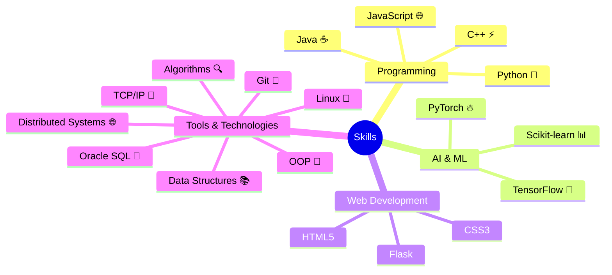

<div align="center">

# Vamsi Krishna
### AI Developer | Full Stack Engineer | Problem Solver

```typescript
const passion = "Turning Ideas into Reality";
const status = "Always Learning, Always Growing";
```

</div>

## 🎓 Education Journey

| Degree & Institution | Timeline & Score |
|---------------------|------------------|
| **B.Tech. in Computer Science** <br> Gayatri Vidya Parishad, Kommadi | 2021 - 2025 (Expected) <br> 📊 CGPA: 8.92 |
| **Intermediate in MPC** <br> Sri Chaitanya Junior College | 2019 - 2021 <br> 📊 Percentage: 97.7% |
| **SSC** <br> Sri Chaitanya EM School | 2019 <br> 📊 GPA: 9.8 |

## 🛠️ Technical Arsenal



## 🚀 Featured Projects

### 🤖 AI Flowchart Generator
- **Tech Stack:** Flask • GenAI • Python
- **Description:** Intelligent flowchart generation powered by AI
- [Live Demo](https://ai-flowchart.vercel.app/)

### 🌐 KV Nexus
- **Tech Stack:** Full Stack • Gemini API • REST
- **Description:** Your AI-powered web companion
- [Live Demo](http://kv-nexus.vercel.app/)

### 👁️ Symmetry Detection
- **Tech Stack:** OpenCV • NumPy • Python
- **Description:** Advanced computer vision symmetry detection
- [Live Demo](https://symmetry-detection.onrender.com)

### 📄 Document Summarization
- **Tech Stack:** NLP • AI • Python
- **Description:** Smart document summarization using AI
- [Live Demo](https://lnkd.in/gK_NP5gP)

<details>
<summary><h3>📦 More Amazing Projects</h3></summary>

| Project | Description |
|---------|-------------|
| [Text Classification using AI](https://github.com/kvcops/AI-Text-Classification) | Web application for AI/human text classification |
| [Zomato Restaurant App](https://github.com/kvcops/Zomato-Web-app) | Advanced restaurant data analysis & search platform |
| AI Career Guidance Bot | NLP-powered career guidance chatbot |

</details>

## 📊 GitHub Statistics

<div align="center">

<!-- Since we can't include actual GitHub stats images, we'll use markdown comments to show where they would go -->
<!-- GitHub stats would go here -->
<!-- GitHub streak stats would go here -->
<!-- GitHub trophy would go here -->

</div>

## 🤝 Let's Connect!

<div align="center">

[](https://vamsikrishna28.vercel.app/)
[](https://www.linkedin.com/in/karri-vamsi-krishna-966537251)
[](https://github.com/kvcops)

</div>

---

<div align="center">

```javascript
while (alive) {
    eat();
    sleep();
    code();
    repeat();
}
```

</div>
