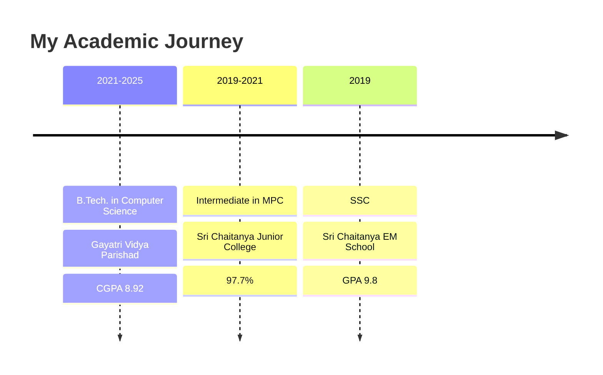

<div align="center">
  
```ascii
██╗   ██╗ █████╗ ███╗   ███╗███████╗██╗    ██╗  ██╗██████╗ ██╗███████╗██╗  ██╗███╗   ██╗ █████╗ 
██║   ██║██╔══██╗████╗ ████║██╔════╝██║    ██║ ██╔╝██╔══██╗██║██╔════╝██║  ██║████╗  ██║██╔══██╗
██║   ██║███████║██╔████╔██║███████╗██║    █████╔╝ ██████╔╝██║███████╗███████║██╔██╗ ██║███████║
╚██╗ ██╔╝██╔══██║██║╚██╔╝██║╚════██║██║    ██╔═██╗ ██╔══██╗██║╚════██║██╔══██║██║╚██╗██║██╔══██║
 ╚████╔╝ ██║  ██║██║ ╚═╝ ██║███████║██║    ██║  ██╗██║  ██║██║███████║██║  ██║██║ ╚████║██║  ██║
  ╚═══╝  ╚═╝  ╚═╝╚═╝     ╚═╝╚══════╝╚═╝    ╚═╝  ╚═╝╚═╝  ╚═╝╚═╝╚══════╝╚═╝  ╚═╝╚═╝  ╚═══╝╚═╝  ╚═╝
```

  <a href="https://git.io/typing-svg"></a>
</div>


## 🎓 Education Trail

<div align="center">



</div>

## 💫 Skills Universe

<table align="center">
<tr>
<td>

### 🔥 Programming Languages
```python
languages = {
    "Expert":     ["Python", "C++", "Java"],
    "Proficient": ["JavaScript", "C"],
    "Familiar":   ["HTML", "CSS"]
}
```

</td>
<td>

### 🤖 AI & ML Tools
```python
ai_ml_stack = {
    "Frameworks": ["TensorFlow", "PyTorch"],
    "Libraries":  ["Scikit-learn", "NumPy"],
    "Areas":      ["Computer Vision", "NLP"]
}
```

</td>
</tr>
<tr>
<td>

### 💾 Database & Systems
```python
systems = {
    "Databases":  ["Oracle SQL"],
    "OS":         ["Linux", "Windows", "macOS"],
    "Protocols":  ["TCP/IP", "Distributed Systems"]
}
```

</td>
<td>

### 🛠️ Developer Tools
```python
tools = {
    "Version Control": ["Git", "GitHub"],
    "Core Concepts":   ["DSA", "OOP"],
    "Other":          ["Information Retrieval"]
}
```

</td>
</tr>
</table>

## 🌟 Featured Projects

<div align="center">
<a href="https://ai-flowchart.vercel.app/" target="_blank">

</a>
<a href="http://kv-nexus.vercel.app/" target="_blank">

</a>
<a href="https://symmetry-detection.onrender.com" target="_blank">

</a>
</div>

<details>
<summary><h3>🎯 Project Details</h3></summary>

| Project | Tech Stack | Description |
|---------|------------|-------------|
| [AI Flowchart Generator](https://ai-flowchart.vercel.app/) | `Flask` `GenAI` `Python` | Generate intelligent flowcharts and mindmaps using AI |
| [KV Nexus](http://kv-nexus.vercel.app/) | `Full Stack` `Gemini API` `REST` | AI web companion with multiple generation features |
| [Symmetry Detection](https://symmetry-detection.onrender.com) | `OpenCV` `NumPy` `Python` | Computer vision tool for shape symmetry analysis |
| [Document Summarization](https://lnkd.in/gK_NP5gP) | `NLP` `AI` `Python` | Smart PDF summarization using cutting-edge AI |
| [Text Classification](https://github.com/kvcops/AI-Text-Classification) | `AI` `ML` `Python` | Human vs AI text classifier |
| [Zomato App](https://github.com/kvcops/Zomato-Web-app) | `Web` `API` `JavaScript` | Restaurant search and filter application |

</details>

## 📊 GitHub Analytics

<div align="center">
  
  
  
  
  <p align="center">
    
    
  </p>
</div>

## 🤝 Let's Connect

<div align="center">
  
[](mailto:21131A05C6@gvpce.ac.in)
[](https://www.linkedin.com/in/karri-vamsi-krishna-966537251)
[](https://github.com/kvcops)

</div>

<div align="center">
  
</div>


