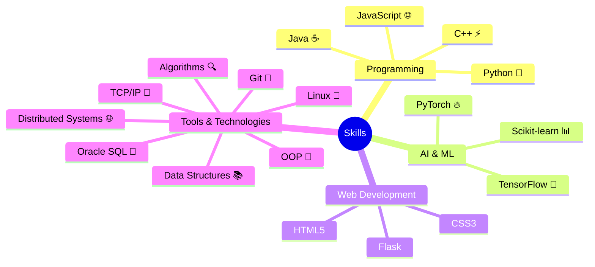

    

<h2> 🎓 Education Journey</h2>

<table>
<tr>
    <td width="50%">
        <h3>🏛️ B.Tech. in Computer Science</h3>
        
<b>Gayatri Vidya Parishad, Kommadi</b>

        
2021 - 2025 (Expected)

        
📊 CGPA: 8.92

    </td>
    <td width="50%">
        <h3>📚 Intermediate in MPC</h3>
        
<b>Sri Chaitanya Junior College</b>

        
2019 - 2021

        
📊 Percentage: 97.7%

    </td>
</tr>
<tr>
    <td colspan="2" align="center">
        <h3>🎯 SSC - Sri Chaitanya EM School</h3>
        
2019 | GPA: 9.8

    </td>
</tr>
</table>

<h2>
   
  Technical Arsenal
</h2>

<h2>
  
  Featured Projects
</h2>

<table>
<tr>
<td width="50%">
<h3 align="center">
    
    AI Flowchart Generator
</h3>

<strong>Flask • GenAI • Python</strong> - Intelligent flowchart generation powered by AI

</td>

<td width="50%">
<h3 align="center">
    
    KV Nexus
</h3>

<strong>Full Stack • Gemini API • REST</strong> - Your AI-powered web companion

</td>
</tr>

<tr>
<td width="50%">
<h3 align="center">
    
    Symmetry Detection
</h3>

<strong>OpenCV • NumPy • Python</strong> - Advanced computer vision symmetry detection

</td>

<td width="50%">
<h3 align="center">
   
    Document Summarization
</h3>

<strong>NLP • AI • Python</strong> - Smart document summarization using AI

</td>
</tr>
</table>

<h3>📦 More Amazing Projects</h3>

<table>
<tr>
<td>
    
</td>
<td>Web application for AI/human text classification</td>
</tr>
<tr>
<td>
    
</td>
<td>Advanced restaurant data analysis & search platform</td>
</tr>
<tr>
<td>
    
</td>
<td>NLP-powered career guidance chatbot</td>
</tr>
</table>

  <h2>📊 GitHub Statistics</h2>
  
  
  

    
    
  

  <h3>🏆 GitHub Achievements</h3>
   

<h2>
  
  Let's Connect!
</h2>

  

