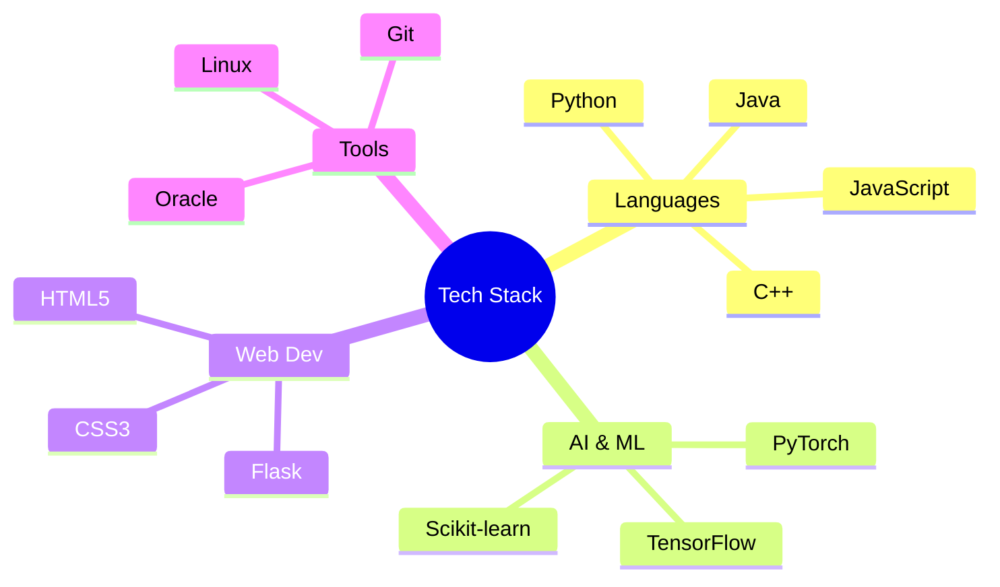

<div align="center">
  
```ascii
 __     __                     _    _  __     _     _              
 \ \   / /__ _ _ __ ___  ___ (_)  | |/ /_ __(_)___| |__  _ __  __ _ 
  \ \ / / _ \ '_ ` _ \/ __|| |  | ' /| '__| / __| '_ \| '_ \/ _` |
   \ V /  __/ | | | | \__ \| |  | . \| |  | \__ \ | | | | | (_| |
    \_/ \___|_| |_| |_|___/|_|  |_|\_\_|  |_|___/_| |_|_| |_\__,_|
```

  
  
  
</div>

<h2>
   
  Tech Arsenal
</h2>



<h2>
  
  Featured Projects
</h2>

<table>
<tr>
<td width="50%">
<h3 align="center">AI Flowchart Generator</h3>
<div align="center">
<a href="https://ai-flowchart.vercel.app/" target="_blank"></a>
<p>
<a href="https://ai-flowchart.vercel.app/" target="_blank">

</a>
</p>
<p><strong>Flask • GenAI • Python</strong> - Web app generating intelligent flowcharts and mindmaps using generative AI</p>
</div>
                                                                                      
</td>

<td width="50%">
<h3 align="center">KV Nexus</h3>
<div align="center">
<a href="http://kv-nexus.vercel.app/" target="_blank"></a>
<p>
<a href="http://kv-nexus.vercel.app/" target="_blank">

</a>
</p>
<p><strong>Full Stack • Gemini API • REST</strong> - AI-powered web companion featuring recipe, health, story & algorithm generation</p>
</div>
</td>
</tr>

<tr>
<td width="50%">
<h3 align="center">Symmetry Detection</h3>
<div align="center">
<a href="https://symmetry-detection.onrender.com" target="_blank"></a>
<p>
<a href="https://symmetry-detection.onrender.com" target="_blank">

</a>
</p>
<p><strong>OpenCV • NumPy • Python</strong> - Advanced tool for detecting symmetry in shapes using computer vision</p>
</div>
</td>

<td width="50%">
<h3 align="center">Document Summarization</h3>
<div align="center">
<a href="https://lnkd.in/gK_NP5gP" target="_blank"></a>
<p>
<a href="https://lnkd.in/gK_NP5gP" target="_blank">

</a>
</p>
<p><strong>NLP • AI • Python</strong> - Smart tool converting dense PDFs into clear, concise summaries using cutting-edge AI</p>
</div>
</td>
</tr>
</table>

<h3>📦 More Projects</h3>

<details>
<summary>Click to Expand</summary>

> [**Text Classification using AI**](https://github.com/kvcops/AI-Text-Classification) - Web application classifying text as human or AI-generated
>
> [**Zomato Restaurant App**](https://github.com/kvcops/Zomato-Web-app) - Advanced web app for searching and filtering Zomato restaurant data
>
> [**AI Chatbot for Career Guidance**]() - Python-based AI chatbot providing career advice using NLP
</details>

<div align="center">
  
</div>

<h2>
  
  Connect with Me
</h2>

<div align="center">
  
[](https://vamsikrishna28.vercel.app/)
[](https://www.linkedin.com/in/karri-vamsi-krishna-966537251)
[](https://github.com/kvcops)

</div>

<div align="center">
  <h3>🏆 GitHub Profile Trophy</h3>
   
  <br><br>
  
  |  |  |
  |---|---|
  
</div>


