<!--
  ███  THE NIGHT ARCHIVE  ███
  Every visual below is a hand-written animated SVG in ./assets (no external image services).
  Regenerate them with:  python3 scripts/gen_assets.py
-->

<a href="https://vamsikrishna28.vercel.app/">
  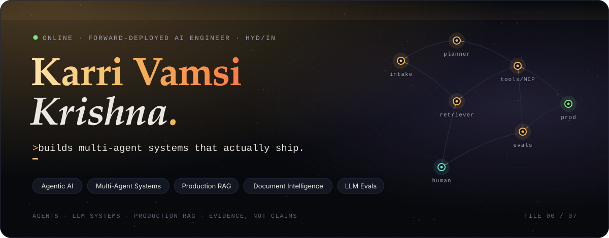
</a>

  

 

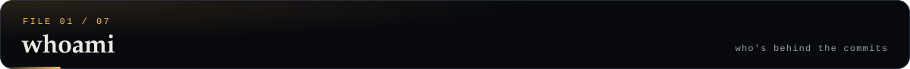

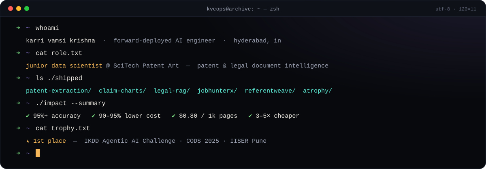

> I embed with real workflows — patent analysts, legal teams, plant engineers — and replace the slow manual parts with **agents, RAG and document AI that hold up in production**. No demos that die on real users: every system below has numbers behind it.

 

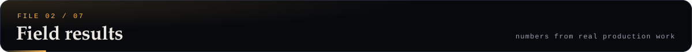

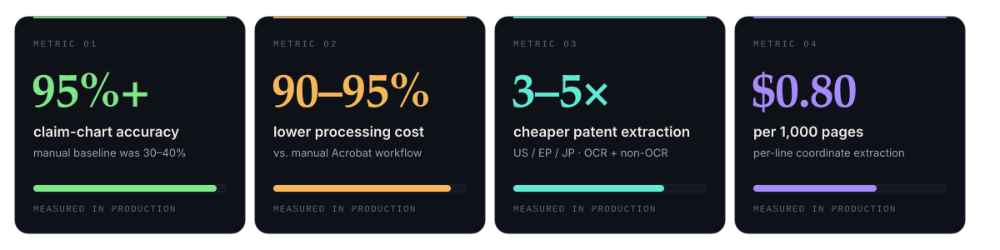

 

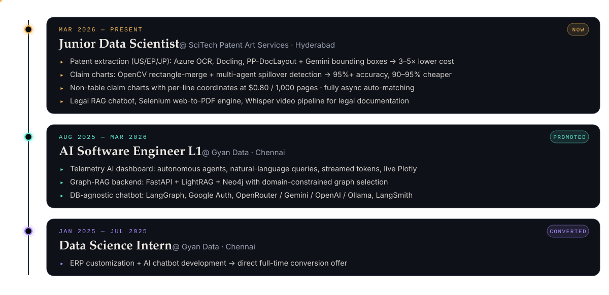

<b>📂 &nbsp;Open the full case files</b>

 

**Junior Data Scientist — SciTech Patent Art Services** · Hyderabad · *Mar 2026 – Present*
- **Patent extraction pipeline (US/EP/JP):** OCR + non-OCR with Azure OCR, PP-DocLayout / Docling (CPU/GPU-optimized) and Gemini bounding boxes for image cropping and LaTeX formulas, line-level coordinate mapping, real-time WebSocket collaboration → **3–5× lower cost**. Re-designed server-to-server transfer to be fully async with auto-matching.
- **Chart & claim construction:** replaced a manual Adobe Acrobat workflow (30–40% accuracy, hours per document) with an automated pipeline — CPU-only OpenCV rectangle-merge for SMask images, multi-agent text-spillover detection, citation extraction → **95%+ accuracy, 90–95% lower cost**, thousands of pages in minutes.
- **Non-table claim charts:** exact per-line coordinates across wildly varying layouts at **$0.80 / 1,000 pages**.
- **Legal RAG chatbot:** parallel ingestion + leaner agent orchestration → lower latency and token spend (FastAPI, PostgreSQL, LangChain/LangGraph).
- **Website-to-PDF & legal media:** Selenium full-page PDF engine that fixes broken Print-to-PDF; video/GIF pipeline with keyframe dedupe (24/30 FPS), Whisper transcripts and LLM summaries.

**AI Software Engineer L1 — Gyan Data** · Chennai · *Aug 2025 – Mar 2026*
- **Telemetry AI dashboard** for real-time turbine monitoring — autonomous agents, natural-language queries, streamed tokens, live Plotly (Streamlit).
- **Graph-RAG backend** with FastAPI + LightRAG + Neo4j and domain-constrained graph selection; Frappe ERP customization with Playwright E2E.
- **DB-agnostic AI chatbot** — LangChain/LangGraph, Google Auth, pluggable OpenRouter / Gemini / OpenAI / Ollama, LangSmith monitoring.

**Data Science Intern — Gyan Data** · Chennai · *Jan 2025 – Jul 2025*
- ERP customization + AI chatbot development → **direct full-time conversion offer**.

 

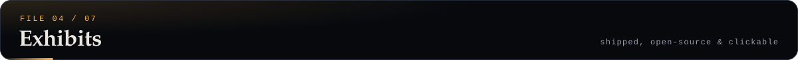

<a href="https://github.com/kvcops/ReferentWeave">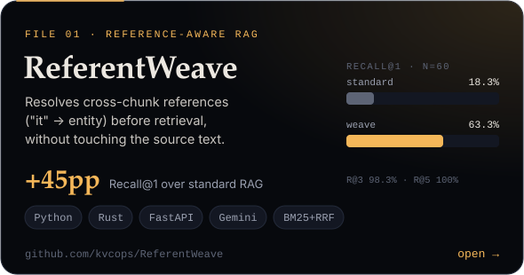</a>
<a href="https://github.com/kvcops/JobHunterX">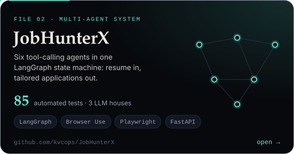</a>
<a href="https://github.com/kvcops/Atrophy">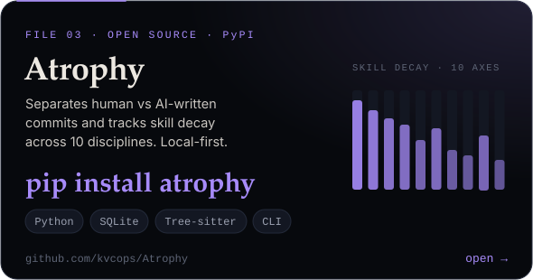</a>
<a href="https://github.com/kvcops/Deep-Research-using-Gemini-api">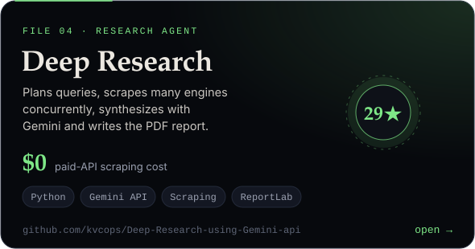</a>
<a href="https://neuriq-ai.onrender.com/">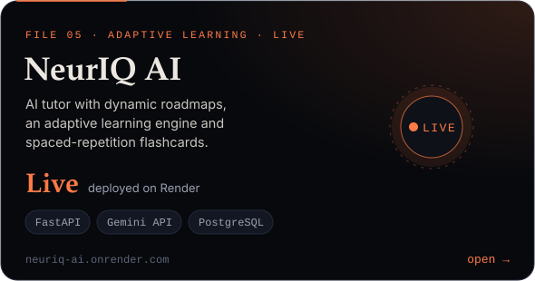</a>
<a href="https://github.com/kvcops/KV-Nexus">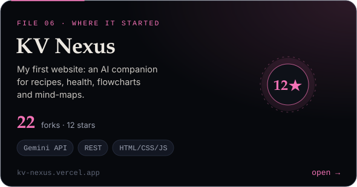</a>

 

<a href="https://github.com/kvcops/JobHunterX">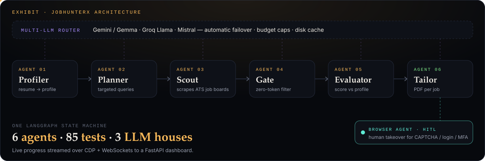</a>

  
    <a href="https://pypi.org/project/atrophy/">Atrophy on PyPI</a> ·
    <a href="https://kvcops.github.io/Atrophy/">Atrophy site</a> ·
    <a href="https://youtu.be/UNdSUAgBMAc">Deep Research walkthrough</a> ·
    <a href="https://neuriq-ai.onrender.com/">NeurIQ AI live</a> ·
    <a href="http://kv-nexus.vercel.app/">KV Nexus live</a>
  

<b>🗄️ &nbsp;From the earlier shelves</b>

 

| Project | Stack | What it does |
|:--|:--|:--|
| **[AI Flowchart Generator](https://ai-flowchart.vercel.app/)** | Flask · GenAI · Python | Natural language → flowcharts, instantly |
| **[Intelligent Doc Summarizer](https://lnkd.in/gK_NP5gP)** | LLM optimization · NLP | Condenses large documents with precision |
| **[AYUSH Herbal Garden](https://github.com/kvcops)** | Flask · Firebase · A-Frame 3D | Immersive VR/3D garden of 50+ medicinal plants with GSAP animations |
| **[AI Text Classifier](https://github.com/kvcops/AI-Text-Classification)** | Python · NLP | Detects AI-generated vs human-written text |
| **[Zomato Restaurant App](https://github.com/kvcops/Zomato-Web-app)** | Full stack · Analytics | Restaurant data analysis & search platform |

 

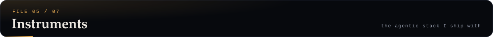

  

 

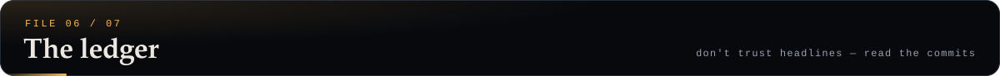

<picture>
  <source media="(prefers-color-scheme: dark)" srcset="https://raw.githubusercontent.com/kvcops/kvcops/output/github-contribution-grid-snake-dark.svg"/>
  <source media="(prefers-color-scheme: light)" srcset="https://raw.githubusercontent.com/kvcops/kvcops/output/github-contribution-grid-snake.svg"/>
  
</picture>

 

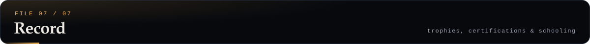

off the clock: ♟️ chess · 📷 photography · 🧮 competitive programming · speaks English, Telugu, Hindi

 

<a href="mailto:Vamsikv28@gmail.com">
  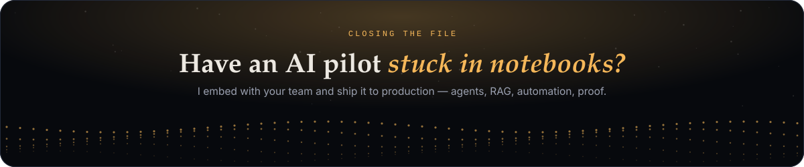
</a>

every pixel above is hand-written SVG &nbsp;·&nbsp; zero claims without artifacts &nbsp;·&nbsp; © 2026 Karri Vamsi Krishna

